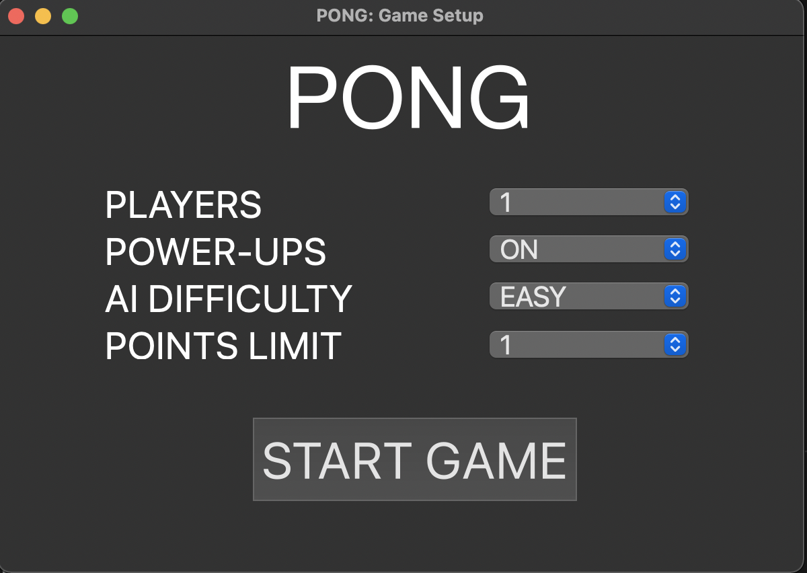

# PONG

# BUGS TODO:

* Ball gets stuck in/on paddle occasionally
* Ball size trips out when reversiball-x/y powerup hit. 

Pong clone in C++ using raylib game library, and python GUI using PyQT

from /pong run game from python main after installing dependencies with:

```sh
        python3 main.py
```

## Dependencies

```sh
        brew install raylib
```
```sh
        brew install PyQt6
```

## Game Menu

PLAYERS: How many user controlled players to activate. If 1, player 2 will be computer controlled.
POWERUPS: Powerups can be turned ON or OFF.
AI DIFFICULTY: Can be set to EASy, MEDIUM or HARD.
POINTS LIMIT: can be set from 1 to 10 points to win.
Press START GAME to begin match.
Click the 'x' at top left to exit the program.



## Game Window

Controls are listed below. The scores are displayed in the top centre of the game window. 


## Powerups

Powerups will display as Circles which when collided with, the powerup is activated for the player who hit it. The powerups will be visibly identical but with different effects on collision.

* Invisiball: The ball will be concealed after contact until the ball either goes out of court or is returned by the opponent.
* Reversiball-X: The ball direction is reversed on the x-axis upon collision
* Reversiball-Y: The ball direction is reversed on the y-axis upon collision
* Big-Paddle: The paddle of the player who hit the powerup is doubled in size until either a point is scored or another powerup is activated by either player.
* Mini-Paddle: The paddle of the player who hit the powerup is halved in size until either a point is scored or another powerup is activated by either player.


## Winner Window

 Simply displays the winning sides number. Both the button and the 'x' button will return the user to the main menu.


## Controls

Controls for both players are as below:


